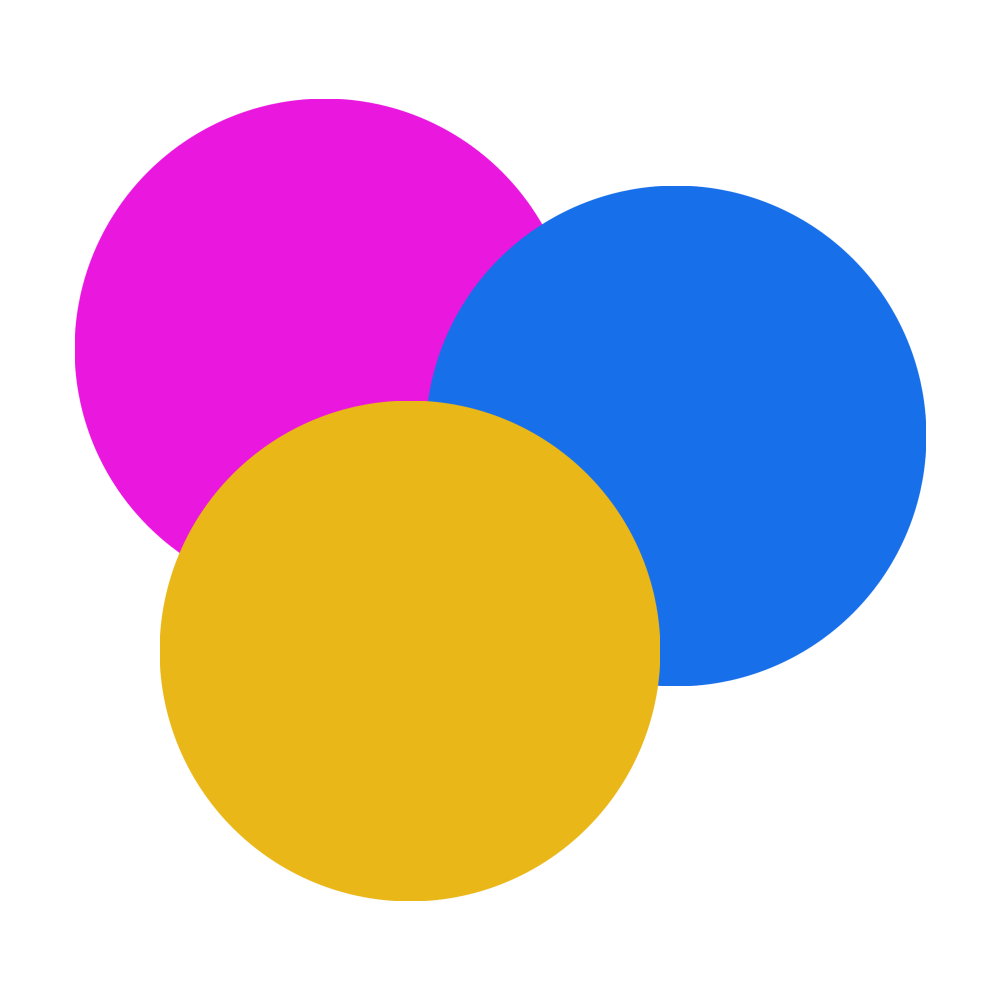

# treats

## About

The goal of `treats` is to create something that

1. Is the only place someone to look for the internet-content they may be interested in
2. Displays this internet-content in a way that conveys which content is likely more important to the user at the moment

`treats` tries to accomplish this by giving users a collection of content sources, called Treat Sources, that can be customized and composed to create a feed of prioritized Treat Items.

Treat Items are intended to be very flexible, and shouldn't be thought of as representing any one particular kind of content (news article, podcast, email, etc.). Some examples of things that could be represented as a Treat Item...

- A Reddit submission
- A sports score
- A Trello card
- A stock ticker
- A Twitch stream
- A calendar event

For more background info on the goal of the project, please see the [original spec](./docs/original_one_pager.md)
